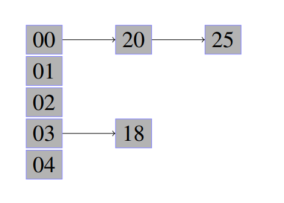
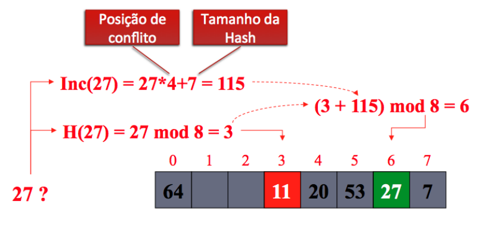

# Tabela Hash

[](https://github.com/PedroLouback/TrabalhoFinal-Prog.2)
[](https://code.visualstudio.com/docs/?dv=linux64_deb)


## Sumário

<ul align="left">
 <li><a href="#problema-proposto">Problema Proposto</a>  </li>
 <li><a href="#tabela-hash">Tabela Hash</a>  </li>
 <li><a href="#lógica">Lógica</a>  </li> 
 <li><a href="#resultados-e-análises">Resultados e Análises</a></li>
 <li><a href="#bibliotecas">Bibliotecas</a> </li>
  <li><a href="#compilação-e-execução">Compilação e Execução</a> </li>
</ul>

---

## Problema Proposto

Implementar dois tipos de tabela Hash:

- [X] Hash de Endereçamento Fechado;
- [X] Hash de Endereçamento Aberto por Hash Dupla;

<div align="justify">
O código deve ter um vetor de no mínimo 20 valores inteiros, os quais serão utilizados como entrada  para as duas estruturas que, por sua vez, são criadas com o dobro do tamanho do vetor (i.e., número primo maior que esse valor dobro). Feito isso, como resultado da execução deve-se apresentar o número de colisões ocorridas para ambas as estruturas quando o mesmo vetor é armazenado. Por fim, apresentar uma breve discussão dos motivos que levaram uma estrutura a apresentar melhores resultados. 
</div>

---

## Tabela Hash
<div align="justify">
Uma Tabela Hash (também conhecida como tabela de espalhamento ou tabela de dispersão) é uma estrutura de dados especial, que associa chaves de pesquisa de qualquer tipo a valores inteiros, através de uma função. Seu objetivo é, a partir de uma chave simples, fazer uma busca rápida e obter o valor desejado.
<p></p>
Na tabela hash, uma função de transformação recebe cada elemento da entrada e gera uma chave para ele, armazenando-o em uma dada posição da tabela, endereçada pela chave. Formalmente, essa função pode ser representada como h( Kj ) = [1, . . ., M], em que o subconjunto da entrada de tamanho M é mapeada na posição Kj da tabela.
</div>

---

### Função Hash
<p>Uma Função Hash é boa se:</p>
<ul>
  <li>Produz um número baixo de colisões;</li>
  <li>É facilmente computável;</li>
  <li>É uniforme, ou seja, com um tempo constante.</li>
</ul>

<div align="justify">
Em literatura, há diversas implementações de tal função, sendo algumas dessas o resto da divisão, meio do quadrado, método da dobra, método da multiplicação, hashing universal. Se a escolha de tal função for adequada ao conjunto e houver entradas suficiente para armazenar todos os elementos sem a repetição de chaves, o custo da pesquisa cairá para O(1). Vejamos um exemplo utilizando como função o resto da divisão para o conjunto de dados acima apresentado. Para este exemplo, considere a variável T como tamanho da tabela hash e "e" como o elemento a ser indexado.
<p align="center">
  
</p>
Observe através do exemplo que se a função utilizada for adequada e houver espaço suficiente para armazenar um único elemento por posição a estrutura em hash pode alcançar tempos de O( 1 ), o qual se refere ao melhor tempo de execução / melhor caso. Em um caso médio teremos algo próximo de O( 1+N / T ) e no pior caso O( n ). Note pelo exemplo, que a função em questão mapeou mais de um elemento por posição, essa condição da-se o nome de colisão e a forma mais comum de trata-la é utilizando lista simplesmente encadeada como entrada de cada chave da tabela. Para completar o conhecimento, veja o conteúdo apresentado nos vídeos abaixo.
</div>

---

### Tabela Hash de Endereçamento Exterior
<div align="justify">
Utiliza uma lista encadeada para cada endereço da tabela, como na figura abaixo. No nosso caso, utilizamos um vetor para guardar os elementos da Hash.
</div>
<p></p>
<div align="center">

</div>

---

### Tabela Hash Dupla
<div align="justify">
Também chamada de re-hash, calcula o valor da Função Hash principal e caso o enderço estiver ocupado, aplica uma segunda função hash e tenta inserir novamente.
</div>
<p></p>
<div align="center">

 </div>
 
---

## Lógica

É criado um vetor de inteiros e ele é inicializado da seguinte maneira:

```c
srand(time(NULL));
     
    for(int i=0;i<tamvetor;i++)
    {
        vet[i]=rand()%99;
    }
```
A função ```rand()%99``` , da biblioteca time.h, preenche randomicamente o vetor, por meio do for, com números de 0 a 99.

Depois disso, as Hashs, de Endereçamento Externo e a Dupla, são criadas, iniciadas, e recebem os valores presentes no vetor.

  <ul>
  <li> <i>Hash Fechada</i>
  
```c

HashC hc;

    InitializeC(&hc,tamvetor);

    for(int i=0;i<tamvetor;i++)
    {
        InsertC(&hc, vet[i]);
    }

 ```
 
A Hash fechada é criada a partir de duas structs:

 ```c
struct DataTableC{
	int key;
	int valores[20];
};

struct HashC{
	int M; 
	DataTableC *tableC; 
	int colisoesC; 
};
  ```
  Onde M é o tamanho da Hash, que no caso do endereçamento externo é do mesmo tamanho do vetor; a variável colisões, que é iniciada como 0 e incrementada cada vez que o algoritmo precisa inserir um valor em um vetor que não está vazio;  e um ponteiro do tipo da variável  ```DataTableC```  que tem dentro dela, as chaves e um vetor de valores. Tanto o vetor de valores como as chaves são inicializados com o valor -1 para o controle de inserções.
  A função ```InsertC(&hc, vet[i])``` recebe a hash e o valor que desejamos adicionar nela. Por meio desse valor, utilizando a Função Hash 1, que é dada pelo resto da divisão do valor pelo tamanho total da hash, a função calcula a chave e procura para ver se ela já está presente na hash. Se sim, ela insere o valor em uma posição vazia do vetor daquela chave e se não, ela insere a chave e o valor como a posição 0 do vetor de valores dessa chave.
  
 </li>
 
   <li><i>Hash Dupla</i>
   
```c
 M=calculaTamanhoHashDupla(tamvetor);

    HashTable h;
    Initialize(&h, M);

    for(int i=0;i<tamvetor;i++)
    {
        Insert(&h, vet[i]);
    }

 ```
 
A Hash dupla é criada a partir de duas structs:

 ```c
struct DataTable{
	int key;
	int value;
};


struct HashTable{
	DataTable *table;
	int M;
	int colisoesD;
};
  ```
  Onde M é o tamanho da Hash, que no caso da Hash Dupla, é o número primo que seja mais próximo e maior do que o tamanho do vetor; a variável colisões, que é iniciada como 0 e incrementada cada vez que o algoritmo precisa calcular a segunda função hash;  e um ponteiro do tipo da variável  ```DataTable```  que tem dentro dela, a chave e um valor. A chave é inicializada com -1 e o valor com 0 para cada posição menor que o tamanho M da Hash.
  A função ```Insert(&h, vet[i])``` recebe a hash e o valor que desejamos adicionar nela. Por meio desse valor, utilizando a Função Hash 1, que é dada pelo resto da divisão do valor pelo tamanho total da hash, a função calcula a chave e procura para ver se ela já está presente na hash. Se sim, ela calcula novamente a chave por meio do resto da divisão do incremento do valor de conflito pelo tamanho da hash. Se ela retorna para o valor inicial sem conseguir realizar a inserção, é retornada uma mensagem informando que a Hash está cheia.
  
 </li>
 </ul>
 
 As hashs são imprimidas quando o processo de cada uma acaba e no final aparecem as colisões que cada uma obteve.


---

## Resultados e Análises 

### Exemplo de execução:

Dado um vetor com valores randômicos representados abaixo:

<div align="center">

</div>

A tabela Hash Fechada foi imprimida da seguinte maneira:

<div align="center">

</div>

Já tabela Hash Dupla foi imprimida da seguinte maneira:

<div align="center">

</div>

OBS: Ambos prints mostram apenas uma parte da impressão.

Por fim, temos a impressão dos números de colisões:

<div align="center">

</div>

### Sobre o número de colisões
 Após diversas repetições na execução do código, nota-se que a hash fechada tende a ter menos colisões do que a dupla. Isso acontece porqu
---

## Bibliotecas

<p>Para o funcionamento do programa, é necessário incluir as seguintes bibliotecas: 
<ul>
    <li><code>#include 'stdlib.h'</code></li>
    <li><code>#include 'stdio.h'</code></li>
    <li><code>#include 'stdbool.h'</code></li>
    <li><code>#include 'time.h'</code></li>
</ul>

---

## Compilação e Execução
<div align="justify">
O algoritmo disponibilizado possui um arquivo Makefile que realiza todo o procedimento de compilação e execução. Para tanto, temos as seguintes diretrizes de execução:
</div>
<p></p>
<div align="center">

| Comando                |  Função                                                                                           |                     
| -----------------------| ------------------------------------------------------------------------------------------------- |
|  `make clean`          | Apaga a última compilação realizada contida na pasta build                                        |
|  `make`                | Executa a compilação do programa utilizando o gcc, e o resultado vai para a pasta build           |
|  `make run`            | Executa o programa da pasta build após a realização da compilação                                 |
</div>

---

## Contato

<div>
<p align="justify"> Thaissa Vitória</p>
<a href="https://t.me/thaissadaldegan">
 

<a href="https://www.linkedin.com/in/thaissa-vitoria-daldegan-6a84b9153/">

</a>
</div>

